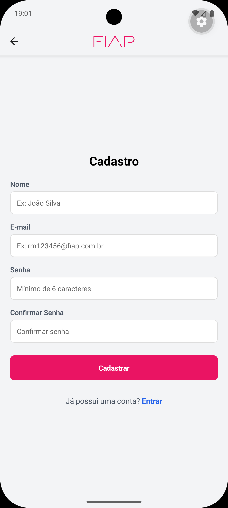
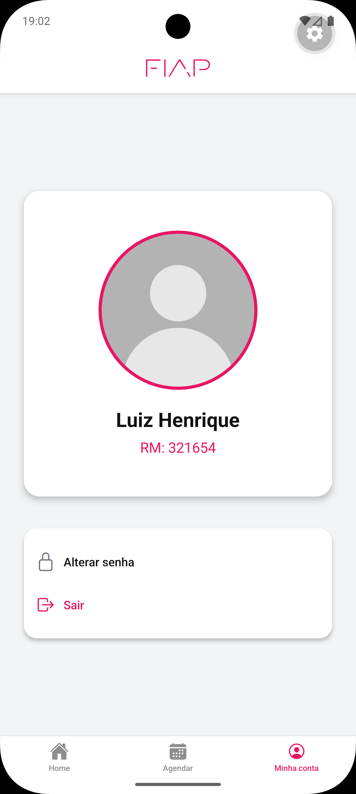

# Agendamento de laboratórios FIAP

Um simples aplicativo *mobile* para agendar laboratórios na [FIAP](https://www.fiap.com.br), visando facilitar o gerencimento de salas ocupadas e remover barreiras burocráticas que possam atrasar e, eventualmente, inviabilizar o processo.

## Funcionalidades

README.md
6 KB
depois só mandar o link do repositório no teams https://github.com/luizhmg28/fiap-cpad-cp2-agendamento-laboratorios
index
 — 17:30


index
__index
Zoe/Player
 
 
 
 
 
 
Learning about myself

# Agendamento de laboratórios FIAP

Um simples aplicativo *mobile* para agendar laboratórios na [FIAP](https://www.fiap.com.br), visando facilitar o gerencimento de salas ocupadas e remover barreiras burocráticas que possam atrasar e, eventualmente, inviabilizar o processo.

## Funcionalidades

- Agendamento de laboratórios por:
    - Horário;
    - Dia;
    - Laboratório;
    - Unidade.
- Cancelamento de agendamento;
- Alteração de senha;
- Login;
- Cadastro.

## Decisões técnicas

### Contextos

- **Autenticação**:
  - Gerenciamento do estado de autenticação e persistência de dados do usuário na aplicação;
  - Mantém as informações do usuário logado e o estado de carregamento inicial;
  - Utiliza do `AsyncStorage` para armazenar os dados locais de usuários cadastrados.

- **Dados da aplicação**
  - Gerencia a lógica de negócios central da aplicação, focado na reserva de agendamentos;
  - Consome o contexto de Autenticação para segregar informações com base no usuário;
    - Utiliza de chaves globais e privadas para fazer a diferenciação de estados.

### Estrutura
O projeto foi estruturado para comportar funcionalidades do [Expo](https://expo.dev), conforme mostra a estruta de pastas abaixo:

```
app-router/
|   app/
|   |   (auth)/
|   |   |   _layout.js
|   |   |   cadastro.js
|   |   |   login.js
|   |   (perfil)/
|   |   |   _layout.js
|   |   |   trocarSenha.js
|   |   (tabs)/
|   |   |   _layout.js
|   |   |   account.js
|   |   |   agendar.js
|   |   |   home.js
|   |   _layout.js
|   |   index.js
|   assets/
|   components/
|   |   AuthWrapper.js
|   |   LogoTitle.js
|   context/
|   |   AppDataContext.js
|   |   AuthContext.js
|   utils/
|   |   refreshFlag.js
```

### Hooks

Foram utilizados alteradores de estado como `useEffect` e `useState` para validar reservas passadas, renderizar componentes dinamicamente, como os horários passados.

### Navegação

Para navegar pelo aplicativo, o modo principal foi o uso de ***Tabs*** e ***Stacks*** pelo **expo-router**. Aquele foi utilizado para a parte principal do aplicativo (pós-login) e este foi utilizado para mudar telas como a de login e edição de senha.
## Capturas de tela

**Tela de login** \


**Tela de Cadastro** \


**Tela inicial** \


**Tela de agendamentos** \


**Tela de perfil** \


**Tela de alteração de senha** \


## Vídeo de demonstração

Para ver o aplicativo funcionando, basta acessar o vídeo disponível [aqui](https://youtube.com/shorts/x9itm-0Awpk).

## Diferencial implementado

Como diferencial do projeto, utilizou-se o Expo SecureStore para privatizar o token da sessão do usuário, prevenindo, assim, adulterações de dados de *malwares* enquanto o aplicativo estiver aberto.

O motivo dessa escolha deve-se ao fato de, embora não ser a versão final do sistema, alterações de dados compartilhados comprometeriam todos os usuários do sistema, desde simples alterações nas datas agendadas, até o compartilhamento de senhas de pessoas.

A implementação foi feita diretamente no contexto global e na página de alteração de senha, desse modo criando sessões únicas e seguras para cada usuário. Por ter um tamanho de chave menor (~2KB), esse foi o único uso implementado.

## Autores

- [Gustavo Hackime Costa](https://www.github.com/IAmIndex)
- [Luiz Henrique Macedo Graça](https://github.com/luizhmg28)


## Apêndice

A escolha de *commits* na *main* foi proposital. A decisão foi tomada para facilitar a correção do *checkpoint* pelo professor corretor.


## Rodar localmente

Clone o projeto

```bash
  git clone https://github.com/luizhmg28/fiap-cpad-cp1-agendamento-laboratorios
```

Vá para o diretório do projeto

```bash
  cd app-router
```

Instale as dependências necessárias

```bash
  npm install
```

Inicie o Expo

```bash
  npm start
```

Para rodar a partir deste ponto, é necessário utilizar um emulador de celular. Utilize aquele de sua preferência. Basta seguir as informações disponíveis [aqui](https://docs.expo.dev/get-started/set-up-your-environment/).

**Importante:** Utilizar o aparelho físico pode não funcionar, já que o Expo está em uma versão mais antiga nas lojas de aplicativos.

## Próximos passos

Considerado o ponto atual do projeto, com mais tempo, a equipe desenvolvedora poderia seguir na implementação de um *back-end* e banco de dados robustos.

Além disso, fazer verificações reais e conexões com o sistema da FIAP para lidar com o perfil do usuário seriam pontos importantes a serem levados em conta.

Por fim, a adição de um sistema de notificações é vital para a robustez completa a nível de UX.